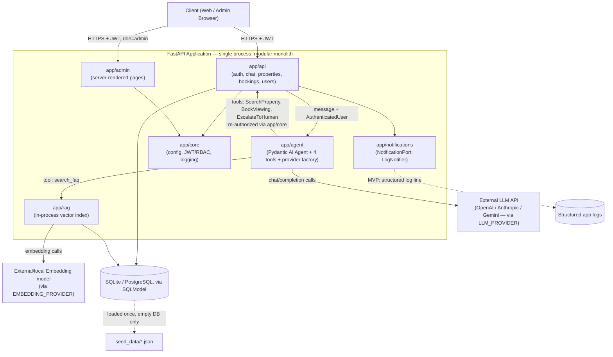
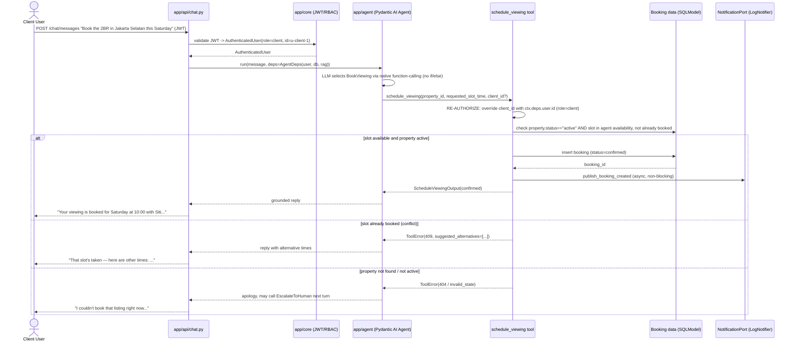
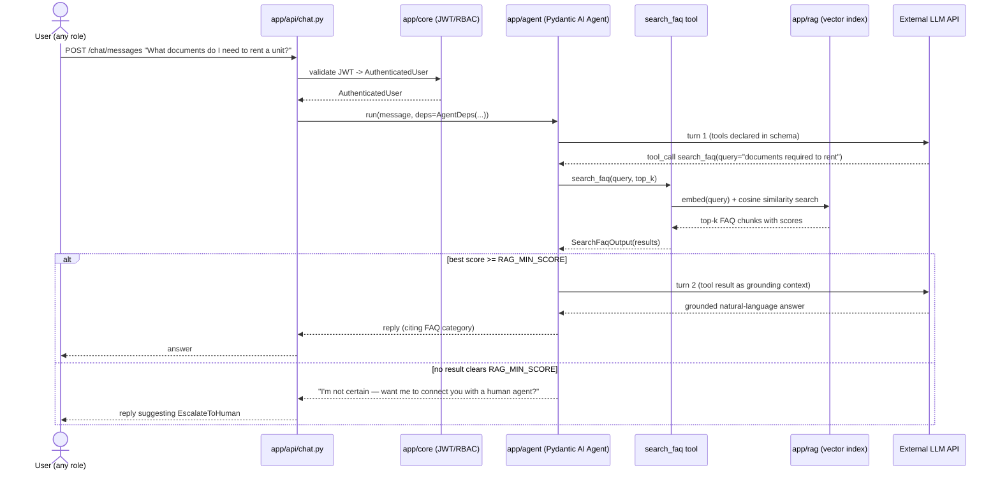

# Real Estate Agentic AI Assistant — MVP

A FastAPI backend that lets clients chat with an LLM-driven agent to get real-estate FAQ answers,
search property listings, and book property viewings, while agents/admins get plain RBAC-protected
CRUD APIs and a minimal admin page for user management and system-prompt editing. The agent's tool
selection is entirely LLM-driven via native function-calling (Pydantic AI) — there is no keyword or
if/else routing anywhere in the request path. Built as a single-service **modular monolith** whose
internal module boundaries are designed to map 1:1 onto the distributed target architecture in
[`../core components.md`](../core%20components.md) (see "Scaling to 100x" below).

## Setup

Requirements: Python >= 3.11, [`uv`](https://docs.astral.sh/uv/).

```bash
cd realestate-ai-assistant
uv sync                      # installs dependencies from pyproject.toml/uv.lock
cp .env.example .env         # then fill in the values described below
uv run uvicorn app.main:app --reload   # once app/main.py exists; current main.py is a placeholder
```

On first startup, `app/db/seed.py` checks whether the configured database is empty and, if so, loads
`seed_data/*.json` (users, properties, FAQ, availability, viewings) so the app is immediately usable
without a manual seeding step. Set `SEED_ON_STARTUP=false` to disable this (e.g. once you have real
data and don't want seed data re-applied against a non-empty DB — the loader still no-ops on a
non-empty DB by default, but the flag gives an explicit kill switch).

### Environment variables

| Variable | Required | Default | Purpose |
|---|---|---|---|
| `APP_ENV` | no | `dev` | `dev`/`prod`, controls log format and docs exposure |
| `LOG_LEVEL` | no | `INFO` | Python logging level |
| `DATABASE_URL` | no | `sqlite:///./app.db` | SQLModel/SQLAlchemy connection string; swap to a Postgres DSN with no code changes |
| `SEED_DATA_DIR` | no | `./seed_data` | Where the seed loader reads JSON from |
| `SEED_ON_STARTUP` | no | `true` | Load seed data into an empty DB on boot |
| `JWT_SECRET_KEY` | **yes** | — | Signing secret for locally-issued JWTs |
| `JWT_ALGORITHM` | no | `HS256` | JWT signing algorithm |
| `JWT_EXPIRE_MINUTES` | no | `60` | Access token TTL |
| `LLM_PROVIDER` | **yes** | — | `openai` \| `anthropic` \| `gemini` — selects which Pydantic AI `Model` the provider factory builds for chat/tool-calling |
| `OPENAI_API_KEY` / `OPENAI_MODEL` | if `LLM_PROVIDER=openai` | model default `gpt-4o-mini` | OpenAI credentials/model |
| `ANTHROPIC_API_KEY` / `ANTHROPIC_MODEL` | if `LLM_PROVIDER=anthropic` | model default `claude-sonnet-4-5` | Anthropic credentials/model |
| `GEMINI_API_KEY` / `GEMINI_MODEL` | if `LLM_PROVIDER=gemini` | model default `gemini-2.5-flash` | Gemini credentials/model |
| `EMBEDDING_PROVIDER` | no | `local` | `openai` \| `gemini` \| `local` — **independent** of `LLM_PROVIDER`, see Design Decisions |
| `EMBEDDING_MODEL` | no | provider-specific default | Embedding model name |
| `RAG_TOP_K` | no | `3` | Default number of chunks `search_faq` retrieves |
| `RAG_MIN_SCORE` | no | `0.55` | Cosine-similarity floor below which `search_faq` reports "no relevant answer" instead of forcing a low-confidence answer |
| `CORS_ALLOWED_ORIGINS` | no | `*` (dev only) | Comma-separated origins |

`.env.example` (to be created by the Backend Engineer alongside implementation) should enumerate all
of the above with safe dev defaults and empty API key placeholders.

## Module Layout

```
realestate-ai-assistant/
  main.py                 # existing placeholder entrypoint (out of scope for this design pass)
  pyproject.toml
  seed_data/               # see "Seed Data" below
  app/
    api/                   # HTTP layer: FastAPI routers, request/response wiring only
      deps.py              #   get_current_user / require_role() dependencies
      auth.py              #   POST /auth/login
      chat.py              #   POST /chat/messages — entrypoint into app/agent
      properties.py        #   property CRUD + read endpoints (RBAC-scoped)
      bookings.py          #   booking CRUD/list endpoints (RBAC-scoped)
      users.py             #   admin-only user management endpoints
    admin/                 # minimal server-rendered admin UI (Jinja2), role=admin only
      routes.py            #   GET/POST /admin/users, /admin/prompts, /admin/bookings
      templates/
    agent/                 # the agentic core
      providers.py         #   LLM_PROVIDER -> Pydantic AI Model factory
      orchestrator.py      #   Agent construction, system prompt loading, run loop
      deps.py               #   AgentDeps: authenticated user + db session + rag index
      tools/
        search_faq.py
        search_property.py
        schedule_viewing.py
        escalate_to_human.py
    rag/                   # retrieval for search_faq
      embeddings.py         #   EMBEDDING_PROVIDER -> embedding function factory
      index.py               #   in-process flat vector index (numpy cosine similarity)
    notifications/         # async side-effect abstraction
      port.py               #   NotificationPort protocol (publish booking/escalation events)
      log_notifier.py        #   MVP implementation: structured log line
    core/                   # cross-cutting concerns
      config.py             #   pydantic-settings Settings, reads .env
      security.py           #   password hashing, JWT encode/decode, role checks
      logging.py             #   structured logging setup
      exceptions.py           #   domain exceptions -> HTTP status mapping
    models/                 # SQLModel ORM entities
      user.py / property.py / booking.py / escalation.py / system_prompt.py
    schemas/                # Pydantic request/response DTOs (kept separate from ORM models)
      chat.py / property.py / booking.py / user.py
    db/
      session.py             # engine/session factory (DATABASE_URL-driven)
      seed.py                 # loads seed_data/*.json into an empty DB on startup
```

`seed_data/` lives at the project root rather than nested under `app/` so it can be inspected, edited,
and diffed without importing the `app` package, and so `SEED_DATA_DIR` can point at a different
location (e.g. an integration-test fixtures folder) without touching code.

## Design Decisions

### 1. Modular monolith now, microservices later

`core components.md` defines the target architecture at 100x scale: 8 independently-deployed
services plus Redis/Kafka/Elasticsearch/PostGIS/a vector DB. Building that for a take-home is the
wrong trade-off — it would spend the assessment's time budget on infrastructure wiring instead of on
agentic design and code quality, which is 55% of the scored weight (Architecture 30% + Agentic AI
Design 25%) with Backend Quality being a separate 20%. A solo developer standing up 8 services,
Kafka, Elasticsearch, and a vector DB for a demo is also directly at odds with "we value ... engineering
judgment more than feature completeness."

Instead, this MVP is **one FastAPI process, internally partitioned into modules with the exact same
responsibility boundaries as the target services**. Each module talks to the others through a narrow
internal interface (a Python function/class call today, an HTTP/gRPC/event call tomorrow) rather than
reaching into another module's data model directly. This is what makes the "how does this scale to
100x" story a *mechanical extraction*, not a redesign:

| MVP module | Future service (`core components.md`) | Extraction trigger / notes |
|---|---|---|
| `app/api/chat.py` | Chat API Service | First candidate to split off — thin, stateless, easy to peel away once session state moves to Redis |
| `app/agent/*` | Agent Orchestrator | Second candidate — LLM-latency-bound, benefits from independent autoscaling vs. the CRUD paths |
| `app/agent/tools/search_faq.py` + `app/rag/*` | Knowledge Base (RAG) | Extract when the FAQ corpus outgrows an in-process index (see RAG section below) |
| `app/agent/tools/search_property.py` + read paths of `app/api/properties.py` | Search Service (Elasticsearch) | Extract when read QPS or query complexity (geo/faceted) exceeds what SQL filtering handles well |
| `app/api/properties.py` (write paths) + `app/models/property.py` | Property Service (PostgreSQL + PostGIS) | Extract when listings need independent write scaling / geo indexing |
| `app/agent/tools/schedule_viewing.py` + `app/api/bookings.py` + `app/models/booking.py` | Booking Service | Extract when booking write volume or conflict-check latency needs isolation from chat traffic |
| `app/agent/tools/escalate_to_human.py` + `app/models/escalation.py` | New Escalation/Support routing capability (not in original `core components.md`; see Open Questions) | Extract once real human-agent routing/CRM integration exists |
| `app/notifications/*` | Notification Service (queue consumer) | Swap `NotificationPort` implementation from `LogNotifier` to a queue publisher — callers never change |
| `app/core/security.py` + `app/api/auth.py` + `app/models/user.py` | Auth Service | Extract when multiple services need centralized token issuance/validation |
| `app/admin/*` | Not a separate service in the target architecture — RBAC-gated views composed over Auth (users) and the Orchestrator's prompt store (prompts) | Stays thin regardless of scale |
| SQLite (dev) / single Postgres (prod-ish) via SQLModel | PostgreSQL + PostGIS (Property), separate Postgres per service after extraction | Swap `DATABASE_URL`; geo queries move from Python Haversine to `ST_DWithin` |
| No Redis in MVP | Redis (session/cache) | Add once session state must be shared across many stateless instances |
| `LogNotifier` (structured log line) | Kafka/RabbitMQ/SQS + Notification Service | Swap the `NotificationPort` implementation only |

Because every module already receives its dependencies (DB session, RAG index, notification port)
through constructor/parameter injection rather than global state, "extraction" in the future is:
move the module's code into a new deployable, replace its in-process call sites with a client
(HTTP/gRPC/event) that implements the same interface, and add the new service to routing config. No
internal module is designed to assume it will always be co-located with the others.

### 2. FastAPI + Pydantic AI + a modular LLM provider

`app/agent/providers.py` reads `LLM_PROVIDER` at startup and constructs the corresponding Pydantic AI
`Model` (`OpenAIModel`, `AnthropicModel`, or `GoogleModel`/Gemini equivalent), each parameterized by
its own `*_API_KEY` / `*_MODEL` env vars. `app/agent/orchestrator.py` builds a single `pydantic_ai.Agent`
against whichever `Model` the factory returns and never branches on provider elsewhere in the codebase.
Switching providers is a `.env` change, not a code change — this is the concrete implementation of
"easily extensible for future agents/services," and it also means adding a fourth provider later is a
one-function change in `providers.py`.

Model routing (cheap/fast model for FAQ-style intents vs. a stronger model for multi-step reasoning),
which `CLAUDE.md`/`core components.md` describe as a target-state cost control, is **deliberately out
of scope for the MVP** — a single configured model handles every turn. Flagged explicitly in the
checkpoint as a scope reduction, not an oversight.

### 3. Autonomous tool selection, no if/else routing

The agent is registered with all four tools up front; on each turn, the underlying LLM's native
function-calling decides whether to call a tool, which one, and with what arguments, based on the
tool's docstring/schema and the conversation so far. There is no `if "book" in message` /
intent-classifier-with-hardcoded-branches anywhere in `app/agent` or `app/api/chat.py` — the only
"routing" logic that exists is RBAC re-authorization *inside* each tool after the LLM has already
chosen to call it (see #4). This directly satisfies the assessment's explicit "NO keyword-based
if/else routing" minimum requirement.

### 4. Tool-name mapping to the assessment's required names

The assessment requires tools literally named `SearchProperty`, `BookViewing`, `EscalateToHuman`.
`CLAUDE.md`'s pre-existing design used snake_case (`search_property`, `schedule_viewing`) consistent
with Python/Pydantic AI convention. Decision: **keep snake_case Python function/module names for
readability, but expose the tool to the LLM (and in the OpenAPI/tool schema) under the literal
required name** via Pydantic AI's tool `name=` parameter. This removes any ambiguity for a grader
inspecting tool schemas or traces, at zero cost to code quality.

| Assessment-required name | Exposed tool name (`name=`) | Implementing module | Notes |
|---|---|---|---|
| `SearchProperty` | `SearchProperty` | `app/agent/tools/search_property.py` (`search_property()`) | Structured + geo property search |
| `BookViewing` | `BookViewing` | `app/agent/tools/schedule_viewing.py` (`schedule_viewing()`) | Kept as `schedule_viewing` internally for continuity with `CLAUDE.md`/`core components.md`, exposed as `BookViewing` |
| `EscalateToHuman` | `EscalateToHuman` | `app/agent/tools/escalate_to_human.py` (`escalate_to_human()`) | New tool, not in the original 3-tool draft — added specifically to satisfy this requirement |
| (not literally required) | `search_faq` | `app/agent/tools/search_faq.py` (`search_faq()`) | Satisfies objective #1 (FAQ/RAG); no mandated literal name, left snake_case |

### 5. RBAC re-authorization at the tool layer

`app/api/chat.py` resolves the caller's identity from the JWT (`app/core/security.py`) into an
`AuthenticatedUser(id, role, email)` **before** the agent ever runs, and passes it into the Pydantic AI
run as `deps=AgentDeps(user=..., db=..., rag=...)`. Tool functions receive `ctx: RunContext[AgentDeps]`
alongside their LLM-supplied arguments and re-check every trust-sensitive field against
`ctx.deps.user` rather than trusting what the LLM passed:

- `schedule_viewing`: if `ctx.deps.user.role == "client"`, the tool **overrides** any `client_id`
  argument the LLM supplied with `ctx.deps.user.id` — a client can never book on someone else's behalf
  no matter what the model generates. `agent`/`admin` callers may supply a `client_id` on behalf of a
  client, but the tool validates that ID exists and (for `agent`) that the target property belongs to
  that agent.
- `search_property`: no identity argument exists in the schema at all for the default case; result
  visibility is filtered by `ctx.deps.user.role` (see RBAC table below), not by an LLM-supplied filter.
- `escalate_to_human`: always tied to `ctx.deps.user.id` / the current `conversation_id`; a user cannot
  escalate a different session.

This mirrors `core components.md` §7's "tool calls are re-authorized, not trusted" principle exactly —
collapsing the network hop into an in-process call does not relax the trust boundary.

### 6. RAG approach for `search_faq`

Chosen: an **in-process flat vector index** (`app/rag/index.py`) — embeddings for the ~12–15 seed FAQ
entries are computed once at startup (or lazily, cached) via the configured `EMBEDDING_PROVIDER`, held
as a small in-memory NumPy array, and queried with cosine similarity. `EMBEDDING_PROVIDER` is
**intentionally decoupled from `LLM_PROVIDER`**: Anthropic has no embeddings API, so if
`LLM_PROVIDER=anthropic`, embeddings still need to come from `openai`, `gemini`, or a local
`sentence-transformers` model (`EMBEDDING_PROVIDER=local`, the zero-API-key default so the project runs
fully offline for FAQ search out of the box).

Trade-off: no FAISS/Chroma/pgvector dependency, no extra infra, trivial to reason about and unit-test
at 15 rows — but it is an O(n) linear scan with no persistence beyond the process (rebuilt from
`seed_data/faq.json` on startup) and would not scale past a few thousand documents or multiple
instances sharing an index. Production upgrade path (already the target design in
`core components.md` §2/§3): move the index into pgvector or a dedicated vector DB behind a Knowledge
Base service, so embeddings are computed once centrally and shared across all Agent Orchestrator
instances instead of recomputed per process.

### 7. Persistence

SQLModel over SQLite by default (`DATABASE_URL=sqlite:///./app.db`) — zero external infra for a solo
dev to run the assessment, full ORM/type-safety via SQLModel, and a straight swap to a Postgres DSN
with no code changes since SQLModel/SQLAlchemy is DB-agnostic outside of PostGIS-specific geo
functions. Geo "near me" search in `search_property` uses a Haversine distance computed in Python over
the (small) seeded dataset — explicitly **not** how this should work at scale; the documented
production path is PostGIS `ST_DWithin`/`ST_Distance` once Property Service is extracted, per
`core components.md`.

### 8. Async side-effects without a message queue

`app/notifications/port.py` defines a `NotificationPort` protocol (`publish_booking_created`,
`publish_escalation_created`); the MVP binds it to `LogNotifier`, which writes a structured log line
instead of sending real email/SMS. This preserves the target architecture's principle that booking/
escalation side-effects are decoupled from the request path (callers never block on notification
delivery) while avoiding a Kafka/RabbitMQ/SQS dependency for a demo. Swapping to a real queue
publisher later touches only `app/notifications/`, nothing upstream.

## API Surface (summary)

| Endpoint | Method | Roles | Purpose |
|---|---|---|---|
| `/api/v1/auth/login` | POST | any | Exchange email/password for a JWT |
| `/api/v1/chat/messages` | POST | admin, agent, client | Send a message to the agent; entrypoint to the tool-calling loop |
| `/api/v1/properties` | GET | admin, agent, client | List/search properties (RBAC-scoped, see below) |
| `/api/v1/properties` | POST/PUT/DELETE | admin, agent (own) | Manage listings |
| `/api/v1/bookings` | GET | admin, agent (own), client (own) | List bookings |
| `/api/v1/bookings/{id}/cancel` | POST | admin, agent (own), client (own) | Cancel a booking |
| `/api/v1/users` | GET/POST/PATCH | admin | User management |
| `/admin/users` | GET/POST | admin | Server-rendered user management page |
| `/admin/prompts` | GET/POST | admin | Server-rendered system-prompt editor (versioned rows in `system_prompts`) |

### Chat endpoint contract

```
POST /api/v1/chat/messages
Authorization: Bearer <jwt>

Request:
{
  "conversation_id": "conv-123" | null,   // null starts a new conversation
  "message": "string"
}

Response 200:
{
  "conversation_id": "conv-123",
  "reply": "string",
  "tool_calls": [
    { "tool": "SearchProperty", "arguments": {...}, "result_summary": "3 matches found" }
  ],
  "created_at": "2026-08-05T10:00:00+07:00"
}
```

### Tool contracts (illustrative — Pydantic AI tool signatures)

```python
# search_faq — RAG lookup, no write, no identity scoping
class SearchFaqInput(BaseModel):
    query: str
    top_k: int = 3          # bounded by RAG_TOP_K server-side, LLM value is a hint not a ceiling

class FaqHit(BaseModel):
    id: str
    question: str
    answer: str
    category: str
    score: float

class SearchFaqOutput(BaseModel):
    results: list[FaqHit]   # empty list, not an error, when nothing clears RAG_MIN_SCORE
```
Roles: admin, agent, client. Failure modes: embedding provider unreachable -> `ToolError` caught by
orchestrator, surfaced as an apology + `EscalateToHuman` suggestion; empty index -> empty `results`
(not an error).

```python
# search_property (exposed as "SearchProperty")
class SearchPropertyInput(BaseModel):
    city: str | None = None
    listing_type: Literal["sale", "rent"] | None = None
    property_type: str | None = None
    min_price: float | None = None
    max_price: float | None = None
    bedrooms: int | None = None
    near_lat: float | None = None
    near_lng: float | None = None
    radius_km: float | None = None
    keywords: str | None = None
    limit: int = 10

class SearchPropertyOutput(BaseModel):
    results: list[PropertySummary]
    count: int
```
Roles: admin, agent, client. Data scoping: `client` always sees `status="active"` only; `agent` also
sees their own `draft`/`under_offer` listings; `admin` unrestricted. Failure modes: no results -> empty
list (not an error); DB unavailable -> `ToolError` -> orchestrator apology + `EscalateToHuman`
suggestion.

```python
# schedule_viewing (exposed as "BookViewing")
class ScheduleViewingInput(BaseModel):
    property_id: str
    requested_slot_time: datetime
    client_id: str | None = None   # only honored for agent/admin callers, see RBAC re-auth above

class ScheduleViewingOutput(BaseModel):
    booking_id: str
    property_id: str
    client_id: str
    agent_id: str
    slot_time: datetime
    status: Literal["confirmed"]
```
Roles: admin, agent, client (self only). Failure modes: property not found (`404`-equivalent
`ToolError`); slot not in agent availability / already booked (`409`-equivalent `ToolError` with
`suggested_alternatives`); property not active (`sold`/`draft`) -> validation error; past
`requested_slot_time` -> validation error.

```python
# escalate_to_human (exposed as "EscalateToHuman")
class EscalateToHumanInput(BaseModel):
    reason: str
    category: Literal["complaint", "complex_request", "policy_exception", "technical_issue", "other"] = "other"
    conversation_summary: str
    urgency: Literal["low", "medium", "high"] = "medium"
    property_id: str | None = None

class EscalateToHumanOutput(BaseModel):
    escalation_id: str
    status: Literal["queued", "queued_unassigned"]
    assigned_agent_id: str | None
    message: str
```
Roles: admin, agent, client — always allowed as a safety valve, always tied to the caller's own
identity/conversation (cannot escalate on behalf of another user). Failure modes: no agent
assignment logic exists in the MVP, so `assigned_agent_id` is always `null` and `status` is always
`"queued_unassigned"` (flagged as an explicit simplification, see Open Questions); persistence
failure -> retried once, then falls back to a static "please contact support@..." reply so the user
is never left without a next step; repeated escalations from the same session are rate-limited to
avoid trivial abuse.

## Architecture (MVP as built)



## Booking Flow (`BookViewing` / `schedule_viewing`)



## FAQ Flow (`search_faq`)



## Scaling to 100x

This section is prep material for the required scaling explanation video, not a replacement for it.
The full target architecture and its rationale live in `../core components.md` and the
`Documentation/audits/2026-08-04-initial-architecture-checkpoint.md` checkpoint; this MVP's module
boundaries (see the mapping table in Design Decisions §1) are chosen so that scaling is an
**extraction and infra-swap exercise, not a rewrite**:

1. **Split the LLM-bound path from the CRUD-bound path first.** `app/agent/*` and `app/api/chat.py`
   become the Agent Orchestrator and Chat API Service — these need to scale on LLM API latency and
   concurrent conversations, independently of property/booking write traffic. Session state moves out
   of request scope into Redis so any instance can serve any conversation (already designed
   stateless in the MVP; Redis just becomes the shared store instead of an in-process/DB lookup).
2. **Move property search off the transactional path.** `search_property` today queries the same
   SQL tables `app/api/properties.py` writes to. At scale this becomes CQRS: Property Service keeps
   Postgres+PostGIS as the write source of truth, and a Search Service indexes into Elasticsearch via
   CDC/outbox, exactly as designed in `core components.md` §2 (Search Service) and §3 (CQRS rationale).
3. **Move the FAQ index out of-process.** `app/rag` becomes a Knowledge Base service backed by
   pgvector/a dedicated vector DB, computing embeddings once centrally instead of per-instance.
4. **Decouple booking side-effects for real.** `LogNotifier` is swapped for a Kafka/RabbitMQ/SQS
   publisher and a standalone Notification Service consumer — `schedule_viewing`'s code does not
   change, only the `NotificationPort` binding.
5. **Centralize auth.** `app/core/security.py` + `app/api/auth.py` become the Auth Service issuing
   JWTs that every extracted service validates independently — RBAC re-authorization at the tool/
   service layer (already enforced in the MVP, see Design Decisions §5) carries over unchanged; it was
   never dependent on being in-process.
6. **Add the observability and infra layer.** OpenTelemetry tracing across the (now real) network
   hops, Prometheus/Grafana, and horizontal autoscaling per service, per `core components.md` §2
   (Observability Stack). The MVP's structured logging in `app/core/logging.py` is the seam this
   plugs into.

Each step is independently deployable and reversible — nothing in the MVP module design requires all
six steps to happen together, which matters for an incremental rollout under real traffic growth
rather than a big-bang rewrite.

## Seed Data

Located in `seed_data/`, IDs are consistent across files so bookings/properties can reference users
and each other:

| File | Contents |
|---|---|
| `users.json` | ~8 seed users across all three roles (1 admin, 3 agents, 4 clients). `hashed_password` is a **placeholder string**, not a real bcrypt hash — the Backend Engineer should replace seed values with real hashes (e.g. via `passlib`) as part of implementing `app/core/security.py`; suggested dev convention is that every seed user's plaintext password is `ChangeMe123!` once hashing lands, purely for local testing. |
| `properties.json` | 15 listings across 10 Indonesian cities, mixed `sale`/`rent`, mixed types (apartment/house/studio/townhouse/villa). Includes one `draft`, one `sold`, one `under_offer` listing specifically to exercise the `search_property` RBAC/status-scoping rules described in Design Decisions §5. |
| `faq.json` | 14 FAQ entries (required documents, deposit policy, pet policy, cancellation/rescheduling, viewing hours, application process, fees, lease terms, maintenance responsibility, utilities, early termination, guarantor/co-signer, payment methods, furnished vs. unfurnished) — ready to embed as-is for `app/rag`. |
| `agent_availability.json` | 10 viewing slots across the three seed agents/several properties; two are pre-marked `booked` and correspond 1:1 to confirmed entries in `viewings.json`, so `schedule_viewing`'s conflict-detection path is testable immediately without creating new data. |
| `viewings.json` | 3 sample bookings (2 `confirmed`, matching the `booked` availability slots; 1 `cancelled`, matching a slot that is `open` again) — covers both the happy path and the "slot freed up after cancellation" case. |
